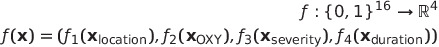

# Axes of Prognosis: Identifying Subtypes of COVID-19 Outcomes
Emma Whitfield (@ekw26) and Claire Coffey(@clairecoffey)

**Preprint:** Emma Whitfield, Claire Coffey, Huayu Zhang, Ting Shi, Xiaodong Wu, Qiang Li, Honghan Wu. *Axes of Prognosis: Identifying Subtypes of COVID-19 Outcomes.* medRxiv 2021.03.16.21253371; doi: [10.1101/2021.03.16.21253371](https://doi.org/10.1101/2021.03.16.21253371)


## Table of Contents

- [Data Preprocessing Details](https://github.com/knowlab/covid-subtypes#data-preprocessing-details)
    - [ICD-10 Chapter Statistics](https://github.com/knowlab/covid-subtypes#icd-10-chapter-statistics)
    - [Medical Reference Values References](https://github.com/knowlab/covid-subtypes#medical-reference-values-references)
- [Prognosis Space & Classifier details](https://github.com/knowlab/covid-subtypes#technical-details)
    - [Prognosis Space Dimension Reduction Function](https://github.com/knowlab/covid-subtypes#prognosis-space-dimension-reduction-function) 
    - [Random Forest classifcation configurations](https://github.com/knowlab/covid-subtypes#table-1-random-forest-classifcation-configurations-hyperparameters-and-sampling-coefficients-the-downupsampling-coefficients-are-relative-to-the-number-of-individuals-in-the-most-numerous-class)
 - [Detailed Classification Results](https://github.com/knowlab/covid-subtypes#detailed-classification-results)

## Data Preprocessing Details

We removed duplicate records, leaving 2797 patients for whom a wide range of features were available, including general patient information, co-morbidities, symptoms (recorded as Chinese freetext), lab test results, [ICD-10 admission and discharge codes](https://icd.who.int/browse10/2010/en), and other prognosis features (death, ICU admission, supplementary oxygen, length of stay). We used the [Python package Googletrans](https://pypi.org/project/googletrans/) to translate Chinese freetext, then used [spaCy](https://spacy.io/) to extract keywords relating to smoking and used these to categorise smoking as a binary yes (1) or no (0). 
%text related to symptoms and build a thesaurus of symptoms. We then used pattern matching to identify symptoms recorded for each patient

For discharge codes, we used the python packages [icd10-cm](https://pypi.org/project/icd10-cm/) and [icd10-c2d](https://pypi.org/project/icd10-c2d/) to trim ICD-10 discharge codes (provided as 11-character strings) until they matched a valid ICD-10 code. We removed codes `U07.1 - COVID-19` and `Z22 - Carrier of infectious disease` as, predictably, these were reported for the majority of patients. Since we wished to explore outcomes caused by COVID-19, we discarded codes related to highly prevalent pre-existing conditions, removing `I10 - Essential (primary) hypertension` and `E11.9 - Type 2 diabetes mellitus without complications`.

Given possible heterogeneity in reporting amongst clinicians, we used only chapter level information of ICD-10 codes - overall chapter counts of discharge codes are shown in the [Table below](https://github.com/knowlab/covid-subtypes#icd-10-chapter-statistics). For each patient, we recorded presence of a discharge code from each chapter, resulting in a binary vector for each patient (1: presence of code from chapter; 0: no code from chapter). Note that in this cohort, many people with only mild symptoms were admitted to hospital. This meant that, after removal of the above codes, there were 1742 patients with no recorded discharge codes.

### ICD-10 Chapter Statistics
|  ICD-10   Chapter   | Count |
|---------------------|-------|
| Abnormal Labs       | 153   |
| Blood/Immune        | 137   |
| Circulatory         | 435   |
| Congenital          | 5     |
| Digestive           | 183   |
| Ear                 | 7     |
| Eye                 | 10    |
| Genitourinary       | 112   |
| Health Status       | 131   |
| Infectious diseases | 75    |
| Injury/Poison       | 17    |
| Mental              | 29    |
| Musculoskeletal     | 93    |
| Neoplasms           | 57    |
| Nervous             | 35    |
| Nutritional         | 348   |
| Pregnancy           | 1     |
| Respiratory         | 306   |
| Skin                | 18    |

## Medical Reference Values References

Padilla  O.  Normal  Laboratory  Values  -  MSD  Manual.  MSD  Manuals;  2018.    Available  from:https://www.msdmanuals.com/en-gb/professional/resources/normal-laboratory-values/normal-laboratory-values

NHS.    What    is    blood    pressure?.    NHS;    2019.Available    from:https://www.nhs.uk/common-health-questions/lifestyle/what-is-blood-pressure/.

HF.   What   is   a   normal   pulse   rate?.   British   Heart   Foundation;    2020.Available   from:https://www.bhf.org.uk/informationsupport/heart-matters-magazine/medical/ask-the-experts/pulse-rate

BLF. Breathing and lung function tests. British Lung Foundation; 2020. Available from:https://www.blf.org.uk/support-for-you/breathing-tests/tests-measure-oxygen-levels

The Association for Clinical Biochemistry and Laboratory Medicine. C-Reactive protein. Lab Tests Online UK;2020. Available from:https://labtestsonline.org.uk/tests/c-reactive-protein-crp

CLL  Society.  Normal  Lab  Values.  CLL  Society;  2020.    Available  from:https://cllsociety.org/toolbox/normal-lab-values

Villa P, Jim ́enez M, Soriano MC, Manzanares J, Casasnovas P.  Serum cystatin C concentration as a marker ofacute renal dysfunction in critically ill patients. Critical Care. 2005;9(2):1–5

Bounds EJ, Kok SJ. D Dimer. StatPearls Publishing; 2020. Available from:http://www.ncbi.nlm.nih.gov/pubmed/28613718

Whitworth  G.  Normal  respiratory  rates:   Adults  and  children;  2019.Available  from:https://www.medicalnewstoday.com/articles/324409

Anthony K, Gonzalez A. What Is the Red Cell Distribution Width (RDW) Blood Test?; 2019.  Available from:https://www.healthline.com/health/rdw-blood-test


## Technical details

### Prognosis Space Dimension Reduction Function 
The Dimension Reduction function we used takes the form: \
 
* f_1 is computed by:
```
d_1 = 0
for chapter_presence, weight in zip([Nervous, Abnormal, Musculoskeletal, Circulatory, Digestive, Nutritional, Genitourinary, Respiratory, Blood/Immune], [0.5, 0.5, 0, 0.75, 0, 0, 0, 0.75, 0.5]):
  d_1 += chapter_presence*weight
```

* f_2 is computed by:
```
d_2 = 0
if (non-invasive oxygen) and (invasive oxygen):
  d_2 = 1.25
elif (invasive oxygen):
  d_2 = 1
elif (non-invasive oxygen):
  d_2 = 0.75
if (ECMO):
  d_2 += 0.5
```

* f_3 is computed by:
```
d_3 = 0
if (death):
  # this includes death and (death and icu)
  d_3 = 1.5
elif (icu):
  d_3 = 1
```

* f_4 is computed by:
```
d_4 = 0
if (los >= 14) and (los < 28):
  d_4 = 0.5
elif (los >= 28):
  d_4 = 0.75
```

The Prognosis Space approach, including the dimension reduction functions are implemented in [2c Prognosis Space DbScan](2c_Prognosis_Space_DbScan.ipynb).

### Table 1. Random Forest classifcation configurations: hyperparameters and sampling coefficients. The down/upsampling coefficients are relative to the number of individuals in the most numerous class.

| Clustering                                                                                | Hyperparameters                                                                               | Downsampling co-efficient | Upsampling co-efficient |
|-------------------------------------------------------------------------------------------|-----------------------------------------------------------------------------------------------|---------------------------|-------------------------|
| Baseline KModes Binary                                                                    | criterion='entropy', max_depth=10, min_samples_split=5, n_estimators=15               | 0.6                       | 0.8                     |
| Baseline KModes Multiclass                                                                | n estimators=60, max depth=10, max features=‘sqrt’, min samples split=10, criterion=‘ gini’   | 1                         | 0.8                     |
| Layered Axes KModes Layer 1                                                               | n estimators=30, max depth=10, max features=‘log2’, min samples split=2, criterion=‘ entropy’ | 1                         | 0.8                     |
| Layered Axes KModes Layer 2, Cluster 0                                                    | n estimators=20, max depth=None, max features=‘sqrt’, min samples split=10, criterion=‘ gini’   | 1                         | 0.8                     |
| Layered Axes KModes Layer 2, Cluster 1                                                    | n estimators=20, max depth=5, max features=‘sqrt’, min samples split=10, criterion=‘gini’    | 1                         | 0.8                     |
| Layered Axes Kmodes Layer 2, Cluster 2                                                    | n estimators=15, max depth=None, max features=‘log2’, min samples split=2, criterion=‘ gini’    | 1                         | 0.8                     |
| Layered Axes KModes Layer 2, Severe Patients                                              | criterion='entropy', max_depth=10, min_samples_split=5, max_features='sqrt',  n_estimators=5 | 1                  | 0.8                     |
| Prognosis Space DBScan                                                                    | n estimators=60, max depth=15, max features=‘log2’, min samples split=2, criterion=‘ entropy’ | 1                         | 0.8                     |
| Prognosis Space DBScan, Severe Patients                                                   | max_depth=15, min_samples_split=10, n_estimators=20, criterion='gini', max features = 'auto' | 1               | 0.8                     | 

### Detailed Classification Results 
Results for cross-validation and overall classification performance using random forests for each clustering technique.

#### Baseline Binary K-Modes


#### Baseline Multi-Class K-Modes


#### Layered Axis KModes Layer 2, Cluster 0, Nutritional


#### Layered Axis KModes Layer 2, Cluster 1, Respiratory


#### Layered Axis KModes Layer 2, Cluster 2, Circulatory


#### Layered Axis KModes Layer 2, Severe Patients


#### Prognosis Space DBSCAN, All


#### Prognosis Space DBSCAN, Severe Patients


### Classification Feature Importances
Charts for the feature importances for each random forest classifier, for each classification problem. We used the same features for every classifier, although as shown in the graphs, this is potentially not the optimal approach and better results may be achieved by discounting some features for some classifiers. Feature importances are calculated with both mean decrease in impurity and feature permutation techniques, calculated using sklearn libraries. 

#### Baseline Multiclass K-Modes
Mean decrease in impurity 


Feature permutation


#### Layered Axes K-Modes, All
Mean decrease in impurity 


Feature permutation


#### Layered Axes K-Modes, Severe
Mean decrease in impurity 


Feature permutation


#### Prognosis Space DBSCAN, All
Mean decrease in impurity 


Feature permutation


#### Prognosis Space DBSCAN, Severe Patients
Mean decrease in impurity 


Feature permutation


#### Prognosis Space DBSCAN, Severe Respiratory Patients
Mean decrease in impurity 


Feature permutation

